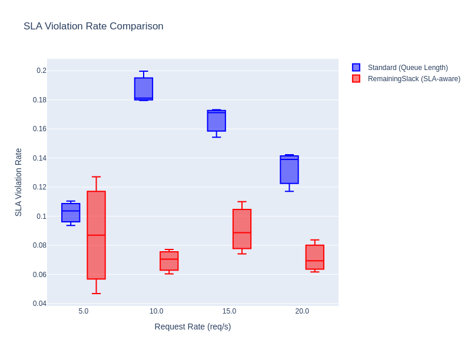
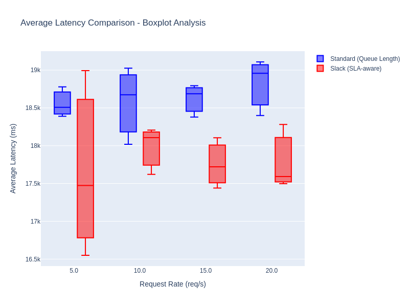
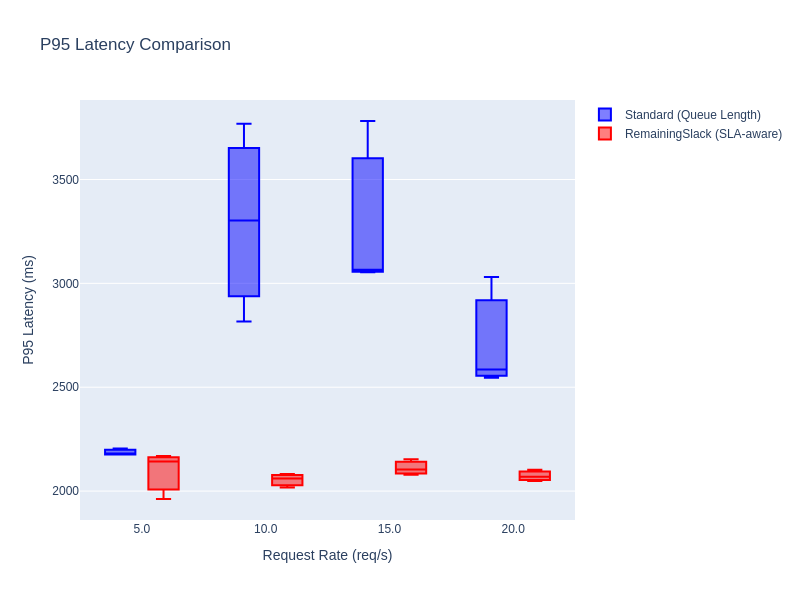
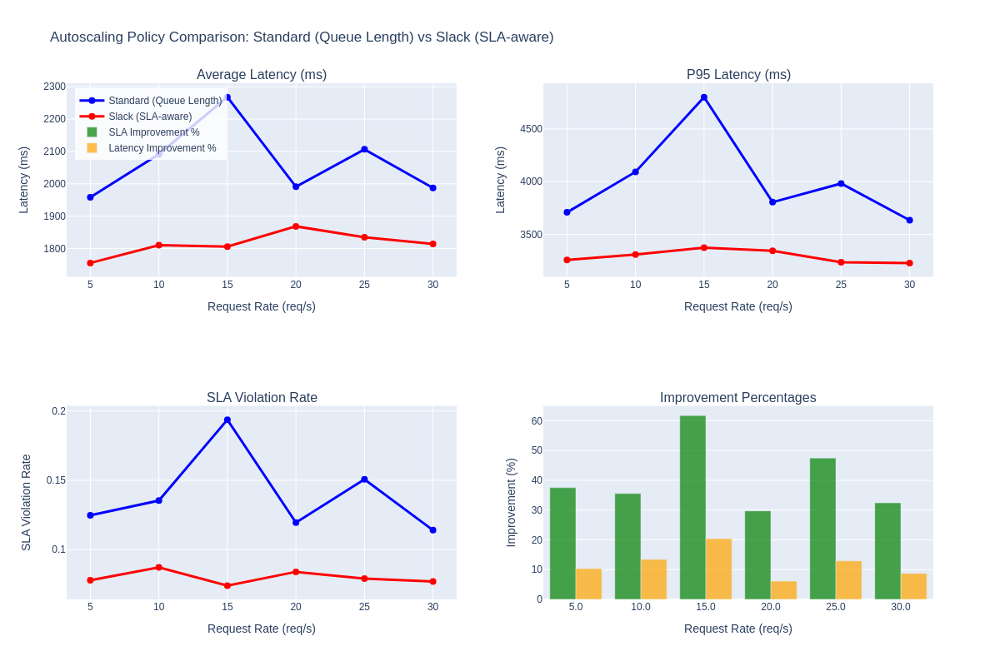

# SLA-Aware Autoscaling for Sequential ML Pipelines: How Ray's Custom Autoscaling API Enables High-Performance Serving

## Introduction

In the world of online application serving, latency unpredictability is a constant challenge. This is especially true for Large Language Models (LLMs) and other complex Foundation Models (FMs) where processing times can vary dramatically based on input size, model complexity, and system load from resource contention. When these models are deployed together in sequential pipelines, the challenges become amplified - a slowdown in one stage can cascade through the entire pipeline, leading to Service Level Agreement (SLA) violations for customers.

Traditional autoscaling approaches, which typically rely on queue length metrics, often fall short in these scenarios. They react to performance degredation rather than anticipating them, leading to delayed scaling decisions and poor SLA compliance.

[Ray v2.51.0](https://github.com/ray-project/ray/releases/tag/ray-2.51.0) introduces a new custom autoscaling API for serve applications. We will be showcasing this API to implement a SLA-aware autoscaling policy called "RemainingSlack", which improves performance for sequential deployments with unpredictable latency patterns.

## The Challenge: serving LLM workflow pipelines with Unpredictable Latency

### Understanding the Problem

The requirement came from Customers of Huawei Cloud's inference service, who used Foundation Models (FMs) in complex workflows. These workflows are typically a sequence of model requests with conditionals, branching, and consist of an assortment of models. Each model would be provisioned as an independent Ray Serve deployment. The goal was to serve all customers efficiently and adhere to the application SLAs in this multi-tenant environment.

```bash
# Example of a sequential FM workflow
Request → Model 1 → Model 2 → Model 3 → Response
```

Each model/deployment in this sequential chain may have different latency characteristics, to illustrate as an example:
- **Model 1**: Fast preprocessing (3s base, 40% variability)
- **Model 2**: Heavy model inference (5s base, 50% variability) - the bottleneck
- **Model 3**: Post-processing (4s base, 45% variability)

With an end-to-end SLA of 3 seconds, this pipeline is already challenging. But when you add:
- **High variability**: Processing times can spike 2-3x due to input complexity
- **Load fluctuations**: Request rates can vary from 5 to 30+ requests/second
- **Resource contention**: Multiple models being loaded concurrently, contesting for the same memory bandwidth

Traditional autoscaling struggles because it only sees local conditions (queue length at each deployment) without understanding the global SLA constraints.

### The Benchmark Setup

The performance comparison was conducted using the benchmark script [`run_sequential_performance_test_sweep.py`](python/ray/serve/tests/run_sequential_performance_test_sweep.py:1), which tests both policies across multiple request rates (5-30 req/s) with realistic workload simulation including:

- **Variable processing times** with different patterns (normal, CPU-intensive, I/O-bound)
- **Spike generation** to simulate real-world unpredictability
- **Sequential pipeline orchestration** through chain deployments

The results are captured in [`sequential_load_test_sweep_results_1763763808.json`](sequential_load_test_sweep_results_1763763808.json:1), showing the following key metrics: `avg_latency_ms`, `p95_latency_ms`, and most importantly `sla_violation_rate`

## Traditional Autoscaling: The Queue Length Approach

### How It Works

Default Ray Serve autoscaling uses a reactive approach based on queue length:

```python
# Default autoscaling configuration
autoscaling_config = {
    "min_replicas": 1,
    "max_replicas": 10,
    "target_ongoing_requests": 5,  # Scale when queue > 5
    "upscale_delay_s": 1,          # Wait 1s before scaling up
    "downscale_delay_s": 4,        # Wait 4s before scaling down
}
```

### Pros and Cons

| Pros | Cons |
|------|------|
| Simple to implement and debug | Reactive, not proactive: Scales only after queues build up |
| Works out of the box | Local optimization: Each deployment scales independently |
| Resource-efficient for deterministic workloads | No SLA awareness: Doesn't consider end-to-end latency requirements |
| Default approach with proven reliability in many scenarios | Delayed response: Built-in delays cause slow reactions to load changes |

In long running and unpredictable pipelines, the drawbacks become evident. By the time Model 2 (the bottleneck) detects a high queue length and scales up, Models 1 and 3 may have already processed requests that will now wait at Model 2, causing SLA violations.

## The RemainingSlack Policy: SLA-Aware Autoscaling

### Core Concept

The RemainingSlack policy, implemented in [`app_level_sequential_remaining_slack_autoscaling_policy()`](python/ray/serve/tests/sequential_performance_load_test_demo.py:34), takes a fundamentally different approach. Instead of reacting to queue lengths, it proactively manages resources based on **remaining time budget** (i.e., "slack") at each deployment, relative to the application level SLA requirements.

### How It Works

#### 1. Time Budget Allocation

The policy first profiles and allocates time budgets to each deployment based on their characteristics; apportioning fractions of the end-to-end SLA:

```python
# Calculate time allocation for each deployment
total_sla_ms = 3000  # 3 second SLA
buffer_ms = 1000     # 1 second safety buffer

# Weight-based allocation based on processing complexity
model1_weight = 0.25  # 25% of time budget
model2_weight = 0.45  # 45% (bottleneck gets more)
model3_weight = 0.30  # 30% of time budget

time_allocation = (total_sla_ms * weight) - buffer_ms
```

Further optimizations may be made at this stage leveraging the workflow hot path based on past execution metrics.

#### 2. Slack Calculation

For each deployment at runtime, the replica computes and reports the "remaining slack" as requests arrive and become processed. It simply measures the difference between allocated time and expected processing time at each deployment:

```python
# Account for processing variability
processing_time_with_variability = base_processing_time * (1 + variability)
remaining_slack = time_allocation - processing_time_with_variability
```

#### 3. Intelligent Scaling Decisions

The scaling logic is sophisticated and context-aware:

```python
if remaining_slack < 0 or avg_latency > time_allocation:
    # Negative slack: processing time exceeded allocated time, scale up aggressively
    urgency_factor = min(3.0, 1.0 + abs(remaining_slack) / base_processing_time)
    desired_replicas = min(max_replicas, int(current_replicas * urgency_factor) + 1)
else:
    # Positive slack: processing time within allocated time, scale conservatively based on actual load
    if queue_length > 0:
        # Scale to handle queued requests
        desired_replicas = min(max_replicas, current_replicas + max(1, queue_length // 5))
    elif utilization > 0.8:
        # High utilization - modest scale-up
        desired_replicas = min(max_replicas, current_replicas + 1)
    elif utilization < 0.3 and current_replicas > min_replicas:
        # Low utilization - scale down
        desired_replicas = max(min_replicas, current_replicas - 1)
```

### Key Innovations

1. **Proactive Scaling**: Scales up before SLA violations occur based on slack-time at each deployment
2. **Application-Level Awareness**: Considers the entire end-to-end application pipeline, not just individual deployments
3. **Adaptive Urgency**: Scaling aggressiveness is proportional to SLA risk
4. **Bottleneck Awareness**: Assigns more resources to deployments that are performance bottlenecks

## Ray Serve's Custom Autoscaling API: The Enabler

Ray Serve's flexible custom autoscaling APIallows d evelopers to implement any scaling logic they desire:

### Autoscaling Policy Definition

The custom policy is defined as a function that takes a dictionary of autoscaling contexts across all deployments as input, and outputs the target scaling decisions keyed by DeploymentID (accompanied by Debug Information as the second item in the returned Tuple):

```python
def app_level_sequential_remaining_slack_autoscaling_policy(
    ctxs: Dict[DeploymentID, AutoscalingContext]
) -> Tuple[Dict[DeploymentID, int], Dict]:
```

### Rich Context Information

Each `AutoscalingContext` provides comprehensive metrics:
- Current replica counts and capacity limits
- Queue lengths and ongoing requests
- Custom metrics (like latency measurements)
- Historical performance data

### Application-Level Configuration

The policy is applied declaratively in the Ray Serve application YAML definition:

```yaml
applications:
  - name: slack_sequential_app
    autoscaling_policy:
      policy_function: ray.serve.tests.sequential_performance_load_test_demo:app_level_sequential_remaining_slack_autoscaling_policy
    deployments:
      - name: slack_model1
        # Individual deployment configs
```

This enables coordinated scaling decisions across all deployments in the application.

## Performance Results: Dramatic Improvements

The benchmark results show compelling improvements across all metrics:

### SLA Violation Rate: 30-62% Improvement

| Request Rate | Default Policy  | Slack Policy | Improvement |
|--------------|-----------------|--------------|-------------|
| 5 req/s      | 12.47%          | 7.80%        | 37.50%      |
| 10 req/s     | 13.53%          | 8.72%        | 35.54%      |
| 15 req/s     | 19.37%          | 7.41%        | 61.74%      |
| 20 req/s     | 11.95%          | 8.40%        | 29.72%      |
| 25 req/s     | 15.07%          | 7.92%        | 47.45%      |
| 30 req/s     | 11.40%          | 7.71%        | 32.41%      |

The most dramatic improvement occurs at 15 req/s, where the Slack policy reduces SLA violations by **61.74%** - from nearly 1 in 5 requests violating SLA to less than 1 in 10.

#### SLA Violation Comparison



### Latency Improvements: 6-20% Better Performance

- **Average Latency**: 6-20% reduction across all rates
- **P95 Latency**: More consistent performance with smaller spikes
- **Best Case**: 20.38% improvement at 15 req/s (2268ms → 1806ms)

#### Average Latency Comparison



#### P95 Latency Comparison



### Consistency and Stability

The Slack policy maintains more consistent performance across different load levels, with less variance in both latency and SLA compliance. This predictability is crucial for production systems.

#### Autoscaling Behavior Comparison



## Why It Works: The Technical Insights

### 1. Anticipatory Scaling

Traditional policies scale when they see problems. The Slack policy scales when it **anticipates** problems based on time budget analysis. This proactive approach prevents SLA violations rather than reacting to them.

### 2. Bottleneck Prioritization

By giving Model 2 (the bottleneck) 45% of the time budget and more aggressive scaling, the policy ensures the critical path gets the resources it needs. This is something queue-based autoscaling cannot achieve.

### 3. Load-Aware Conservative Scaling

When there's positive slack, the policy scales conservatively based on actual load rather than pre-emptively. This prevents over-provisioning while maintaining SLA compliance.

### 4. Application-Level Coordination

Unlike per-deployment autoscaling, the Slack policy makes coordinated decisions across the entire pipeline, understanding that scaling Model 1 without scaling Model 2 would be counterproductive.

## Real-World Applications

### LLM Serving Chains

For LLM applications with sequential processing (tokenization → embedding → generation → post-processing), the Slack policy can dramatically reduce tail latencies and improve SLA compliance.

### Multi-Model Inference Pipelines

Computer vision systems often use sequential models (preprocessing → feature extraction → classification → post-processing). The Slack policy ensures each stage gets appropriate resources based on its complexity and variability.

### Data Processing Workflows

ETL and data processing pipelines with variable processing times benefit from the proactive scaling approach, preventing bottlenecks from cascading through the pipeline.

## Implementation Guide

### Step 1: Define Your Custom Policy

```python
def your_custom_policy(ctxs: Dict[DeploymentID, AutoscalingContext]) -> Tuple[Dict[DeploymentID, int], Dict]:
    decisions = {}
    debug_info = {}

    for deployment_id, ctx in ctxs.items():
        # Your custom logic here
        decisions[deployment_id] = desired_replicas
        debug_info[deployment_id] = {...}

    return decisions, debug_info
```

### Step 2: Configure in YAML

```yaml
applications:
  - name: your_app
    autoscaling_policy:
      policy_function: your_module:your_custom_policy
    deployments:
      # Your deployments
```

### Step 3: Deploy and Monitor

```bash
serve deploy your_config.yaml
```

Monitor the debug information returned by your policy to fine-tune the scaling logic.

## Conclusion

The `RemainingSlack` autoscaling policy represents a paradigm shift from reactive, queue-based scaling to proactive, SLA-aware resource management. By leveraging Ray Serve's custom autoscaling API, it achieves:

- **30-62% reduction in SLA violation rate**
- **6-20% improvement in average latency**
- **More consistent performance across load levels**
- **Better resource utilization through intelligent scaling**

In addition to customer SLAs, organizations may have other commitments (such as resource utilization, time-of-day scaling). Ray Serve's new custom autoscaling policy and metrics aggregations API empowers developers with unparalleled flexibility, to extract the best in both delivering performance to customers and outgoing costs.

## Future Directions

The RemainingSlack policy demonstrates the power of Ray Serve's custom autoscaling API. Future enhancements could include:

1. **Integration with thirdparty APIs**: [External monitoring and metrics sources](https://github.com/ray-project/ray/issues/41135#issue-1993639174) can be used in custom autoscaling policies to drive scaling decisions
2. **Cost-Aware Scaling**: Factor in cloud costs alongside SLA requirements
3. **Multi-Application Coordination**: Coordinate scaling across multiple applications sharing resources
4. **Dynamic SLA Adjustment**: Adapt SLA targets based on business priorities and system conditions


---

**References:**
- [Benchmark Script](python/ray/serve/tests/run_sequential_performance_test_sweep.py:1)
- [Test Results](sequential_load_test_sweep_results_1763763808.json:1)
- [RemainingSlack Policy Implementation](python/ray/serve/tests/sequential_performance_load_test_demo.py:34)
- [Configuration Example](python/ray/serve/tests/sequential_performance_load_test_config.yaml:1)
- [REP](https://github.com/ray-project/enhancements/pull/56#issuecomment-2493932035)
- [Cloudwatch API integration](https://github.com/ray-project/ray/issues/41135#issue-1993639174)